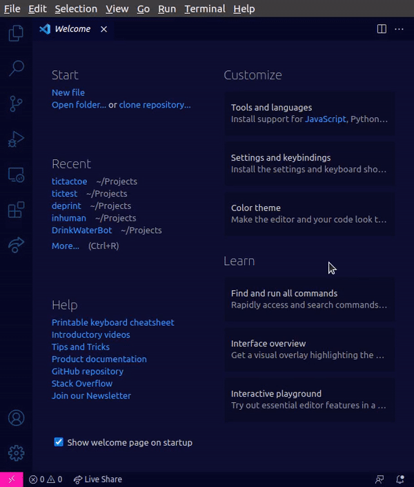

# TicTacToe

<!--  -->
<div style="text-align:center">

</div>
<br>
Ever get bored while waiting for your code to compile? Do you sometimes just feel like you need a small break from all the coding?  

Presenting **TicTacToe** _inside_ VS Code!

## Features

Enjoy a quick game of TicTacToe right from the comfort of your own VS Code workspace. 

## Usage
Ok first open the repo in vscode. Please ensure you open the tictactoe folder. I.E lets say you save it as hacknight/tictactoe on your device do not open it on hacknight but directly the tictactoe folder.

Here’s a clean, well-formatted **Markdown version** of your instructions — perfect for a `README.md` or setup guide:

---

## 🧩 Running the TicTacToe VS Code Extension

Follow these steps to get the extension up and running inside VS Code:

### ⚙️ Setup

1. **Open a terminal** in VS Code.
2. Run the following commands one by one:

   ```bash
   npm install
   npm run compile
   npm run watch
   ```

   > 💡 Note:
   > The `npm run watch` command will **not complete** — this is expected behavior since it continuously watches for changes.

---

### ▶️ Start Debugging the Extension

1. Once `watch` is running, **press `F5`** or go to
   **Run → Start Debugging** in the menu.
2. You might see a popup — click **“Debug Anyway”** if prompted.
3. After that, check the **bottom taskbar** in VS Code:

   * You’ll see the extension running.
   * Click on it.
   * When the **Run Extension** dropdown appears, press **Enter**.

---

### 🎮 Launch the TicTacToe Game

1. Open the **Command Palette**:

   * **Windows/Linux:** `Ctrl + Shift + P`
   * **Mac:** `Cmd + Shift + P`

2. In the search bar, type:

   ```
   TicTacToe
   ```

   or

   ```
   Start a new TicTacToe game
   ```

3. Select it — and voila! 🎉
   Your TicTacToe game should now open inside VS Code.

---

### 🧠 Note for Contributors

If you find the startup process confusing, please let the maintainer know.
However, we’ll first review how much setup you’ve completed before offering direct help.

---


## Future Upgrades

Upgraded AI and multiplayer coming soon!

## Contributing
Checkout the [Contributing Guildelines](https://github.com/acmpesuecc/tictactoe/blob/master/CONTRIBUTING.md)
